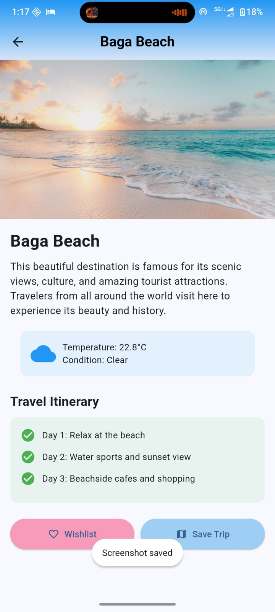

#  TripMate (Travel Planner App) 

A Flutter-based mobile application that helps users plan trips easily by checking weather conditions, organizing travel details, and exploring destinations.

---

##  Features

- 🌤 Weather information for destinations
- 🗺 Trip planning
- 📍 Location based travel planning
- 🎨 Clean and simple UI

---

##  Tech Stack

- Flutter
- Dart
- Weather API
- REST API

---

## Screenshots

| Home Screen | login Screen |
|-------------|---------------|
|  |  |

| wishlist screen | Destination Search | Trip Details |
|----------|-------------------|--------------|
|  |  |  |

##  Download APK

**APK Link:**  

https://drive.google.com/file/d/1-fPyhDL0kxY7S_Si_Lm5IkAYrGOCepBq/view?usp=sharing

## Getting Started

git clone https://github.com/rajvishvakarma088-star/travel-Planner.git

## Author

Raj Vishvakarma  
B.Tech AI & Robotics  
Flutter / Android Developer